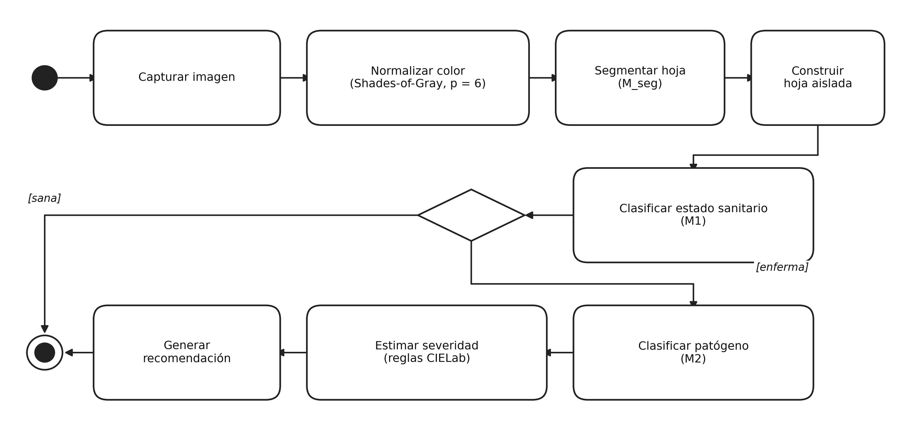

<div align="center">
  

  <h1>Glycine Vision DSS</h1>

  <p><strong>Triaje fitosanitario de soya en el teléfono del productor: detecta la enfermedad, mide su severidad y ajusta el tratamiento al clima, sin conexión.</strong></p>

  <p>
    <a href="LICENSE"></a>
    <a href="https://github.com/alejandroramirezucb/glycine-vision-dss/actions/workflows/ci.yml"></a>
    <a href="https://huggingface.co/alejandroramirezucb/glycine-vision-models"></a>
    <a href="https://huggingface.co/datasets/alejandroramirezucb/soybean_image_dataset"></a>
  </p>
</div>

---

El diagnóstico foliar de soya depende hoy de inspección visual o de laboratorio: caro, lento y poco accesible en campo. Glycine Vision encadena tres modelos que corren **en el propio dispositivo** para dar un diagnóstico trazable en menos de 200 ms por hoja, sin enviar una sola imagen a ningún servidor.

Sobre conjuntos de prueba independientes alcanza **0.980** de exactitud en el estado sanitario, **0.969** en la identificación del patógeno y una concordancia de severidad con criterio experto de **r = 0.953** (MAE 6.5 %).

> **Herramienta de apoyo, no de diagnóstico.** Las recomendaciones son orientativas y no sustituyen al criterio agronómico ni al análisis de laboratorio. Léase [Uso responsable](#uso-responsable) antes de aplicar cualquier producto fitosanitario.

## Tabla de contenidos

- [Cómo funciona](#cómo-funciona)
- [Resultados](#resultados)
- [Inicio rápido](#inicio-rápido)
- [API del backend](#api-del-backend)
- [Reproducir el entrenamiento](#reproducir-el-entrenamiento)
- [Estructura del repositorio](#estructura-del-repositorio)
- [Recursos publicados](#recursos-publicados)
- [Uso responsable](#uso-responsable)
- [Licencias](#licencias)
- [Cómo citar](#cómo-citar)

## Cómo funciona

<div align="center">
  
</div>

La imagen atraviesa cuatro etapas. Cada una acota el problema de la siguiente, de modo que un fallo temprano no se propaga en silencio.

| Etapa | Modelo | Entrada | Salida |
|---|---|---|---|
| Segmentación | U-Net con codificador ResNet50 | 256 × 256 | Máscara hoja–fondo |
| Estado sanitario | EfficientNetB1, doble entrada | 240 × 240 | Sana o enferma |
| Patógeno | EfficientNetB0, doble entrada | 224 × 224 | Cinco categorías |
| Severidad | Reglas de color en CIELab | Región segmentada | Porcentaje de área afectada |

Dos decisiones de diseño sostienen el resto:

**Doble entrada.** Los clasificadores no ven solo la foto: reciben también la hoja recortada por el segmentador, con el fondo a cero. Ambas ramas comparten codificador y sus vectores se concatenan antes de la cabeza. El estudio de ablación muestra que ese aislamiento es el componente de mayor aporte; sustituirlo por la imagen cruda rinde *peor* que usar una sola entrada.

**Severidad sin red neuronal.** El porcentaje de área afectada se calcula con umbrales sobre L\*, a\* y b\* dentro de la región segmentada, separando clorosis, necrosis y defoliación. Es interpretable y auditable píxel a píxel, a cambio de requerir recalibración si cambian mucho las condiciones de captura.

La aplicación consulta además Open-Meteo y desplaza el nivel de severidad un escalón según reglas específicas por patógeno, sin que ello altere el diagnóstico.

## Resultados

| Modelo | Métrica | Valor | IC 95 % |
|---|---|---|---|
| Segmentador | Recall de hoja (Dice; IoU) | 0.977 (0.885; 0.808) | — |
| Estado sanitario | Exactitud (recall clase enferma) | 0.980 (1.000) | 0.960–0.995 |
| Patógeno | Exactitud / F1 macro | 0.969 / 0.968 | 0.949–0.986 |

Frente a un evaluador experto sobre 60 hojas, la severidad concordó con r = 0.953 y CCC = 0.923, y el diagnóstico resultó estadísticamente indistinguible (0.917 frente a 0.883; McNemar p = 0.754).

En un Xiaomi 2203129G de gama media, el flujo completo tarda unos **157 ms** por hoja con las variantes int8.

> Estas métricas provienen de un corpus que combina ocho fuentes públicas **sin partición por procedencia**, por lo que reflejan desempeño interno del corpus y no evidencia de generalización a dominios nuevos. Cada cifra es rastreable hasta el notebook que la produce en [`docs/trazabilidad.md`](docs/trazabilidad.md).

## Inicio rápido

### Aplicación

Requiere Flutter 3.x, Dart ≥ 3.0 y Android SDK ≥ 31. Los modelos se distribuyen con Git LFS, así que hace falta tenerlo instalado antes de clonar.

```bash
git lfs install
git clone https://github.com/alejandroramirezucb/glycine-vision-dss.git
cd glycine-vision-dss/app
flutter pub get
flutter run -d <id_del_dispositivo>
```

### Backend

Opcional: expone los mismos modelos por HTTP para integraciones. La app no lo necesita.

```bash
docker compose up --build
```

La API queda en `http://localhost:8001`. Para ejecutarlo sin Docker:

```bash
cd backend
python -m venv .venv && .venv/Scripts/Activate.ps1   # Linux y macOS: source .venv/bin/activate
pip install -r requirements.txt
python server.py
```

Los modelos del backend no se versionan, así que **tras clonar hay que generarlos** desde `training/outputs/`; si faltan, el servidor aborta al arrancar:

```powershell
pwsh scripts/desplegar_modelos.ps1
```

El detalle de qué variante va a cada destino y por qué está en [`docs/reproducibilidad.md`](docs/reproducibilidad.md).

| Variable de entorno | Valor por defecto | Descripción |
|---|---|---|
| `MODELS_DIR` | `../models` | Carpeta de la que se cargan los `.tflite` |
| `MAX_UPLOAD_BYTES` | `10485760` | Tamaño máximo de imagen aceptado |
| `CORS_ORIGINS` | *(vacío)* | Orígenes permitidos, separados por comas |

## API del backend

```bash
curl -X POST http://localhost:8001/api/diagnose \
  -F "image=@hoja.jpg" -F "lat=-17.78" -F "lon=-63.18"
```

Devuelve `enfermedades_detectadas`, `global_severity_pct`, `seg_mask` (máscara uint8 de 256 × 256 en base64) y `climate`.

## Reproducir el entrenamiento

Los notebooks se ejecutan en orden en Google Colab o Kaggle con GPU. El segmentador debe entrenarse **antes** que los clasificadores, porque produce la hoja aislada que constituye su segunda entrada.

| Notebook | Propósito | Salidas |
|---|---|---|
| `01_preparacion_datos` | Descarga, filtros de calidad, deduplicación por MD5 y pHash, particiones | `splits/` |
| `02_entrenamiento_segmentacion` | U-Net ResNet50 sobre máscaras COCO fusionadas | `model_seg.keras` |
| `03_entrenamiento_m1_estado_sanitario` | EfficientNetB1 de doble entrada | `model1_binary.keras` |
| `04_entrenamiento_m2_patogeno` | EfficientNetB0 de doble entrada | `model2_pathogen.keras` |
| `05_evaluacion_modelos` | Métricas en test con IC 95 % por bootstrap | `training_metrics.json` |
| `06_exportacion_tflite` | Exportación float32 e int8, verificación de equivalencia | `*.tflite` |
| `07_validacion_frente_a_experto` | Cascada completa sobre las hojas evaluadas por el experto | `comparacion_app_vs_experto.json` |
| `08`–`11` | Baselines y ablación por componente, presupuesto reducido y completo | `ablation_full_m2.csv` |
| `12_calibracion_probabilidades` | ECE, MCE y Brier con diagramas de confiabilidad | `calibracion.json` |
| `13_evaluacion_variantes_exportadas` | Keras frente a TFLite float32 e int8 | `evaluacion_variantes.csv` |

El detalle de dependencias entre notebooks, las rutas de datos y el procedimiento de despliegue están en [`docs/reproducibilidad.md`](docs/reproducibilidad.md).

## Estructura del repositorio

```
glycine-vision-dss/
├── app/                  Aplicación Flutter (dominio · aplicación · infraestructura · presentación)
│   └── assets/models/    Modelos desplegados en el dispositivo (Git LFS)
├── backend/              Servicio FastAPI e implementación de referencia de la inferencia
├── training/notebooks/   Notebooks 01–13 de reproducción
├── scripts/              Utilidades de validación y mantenimiento
├── docs/                 Tarjetas de datos y modelos, trazabilidad, arquitectura
├── paper/                Manuscrito y figuras
└── .github/workflows/    Integración continua
```

La implementación de referencia de la inferencia vive en `backend/inference/`: es la fuente de verdad del preprocesamiento, los umbrales y el encadenamiento, y la app replica su comportamiento.

## Recursos publicados

| Recurso | Enlace |
|---|---|
| Conjunto de datos curado | [`soybean_image_dataset`](https://huggingface.co/datasets/alejandroramirezucb/soybean_image_dataset) |
| Modelos entrenados, float32 e int8 | [`glycine-vision-models`](https://huggingface.co/alejandroramirezucb/glycine-vision-models) |
| Resultados numéricos del artículo | [Release `v1.0-paper`](https://github.com/alejandroramirezucb/glycine-vision-dss/releases/tag/v1.0-paper) |
| Manuscrito | [`paper/articulo-cientifico.pdf`](paper/articulo-cientifico.pdf) |

## Uso responsable

El sistema puede influir en decisiones de aplicación de fitosanitarios. Sus recomendaciones son orientativas, nunca prescriptivas:

- No reemplazan al agrónomo ni al diagnóstico de laboratorio.
- Las dosis deben verificarse contra la etiqueta del producto y la normativa local (SENASAG en Bolivia).
- Deben considerarse el riesgo ambiental, la resistencia y la seguridad del aplicador.

No se ha validado con imágenes propias de Santa Cruz: la aplicabilidad regional es plausible pero **no está demostrada**.

## Licencias

El proyecto combina tres componentes con condiciones distintas. No pueden unificarse bajo una sola licencia porque los datos derivan de fuentes de terceros con restricciones propias.

| Componente | Licencia | Alcance |
|---|---|---|
| Código (app, backend, notebooks) | [MIT](LICENSE) | Uso libre con atribución |
| Manuscrito | CC BY 4.0 | Declarado en el propio artículo |
| Conjunto de datos curado | Indeterminada, no comercial | Véase [`docs/dataset-card.md`](docs/dataset-card.md) |
| Modelos entrenados | Heredan la condición del conjunto de datos | Uso académico |

El conjunto de datos hereda **CC BY-NC-SA 4.0** de PlantVillage e incluye dos fuentes sin licencia declarada, por lo que **no debe asumirse reutilizable comercialmente**.

## Cómo citar

```bibtex
@software{jaldin_ramirez_2026_glycine_vision,
  author  = {Jaldín Torrico, Edgar and Ramírez Vallejos, Alejandro},
  title   = {Glycine Vision DSS},
  version = {1.0.0},
  year    = {2026},
  url     = {https://github.com/alejandroramirezucb/glycine-vision-dss}
}
```

Los metadatos completos están en [`CITATION.cff`](CITATION.cff). Para contribuir, véase [`CONTRIBUTING.md`](CONTRIBUTING.md).
